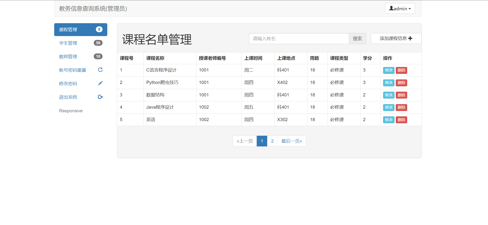
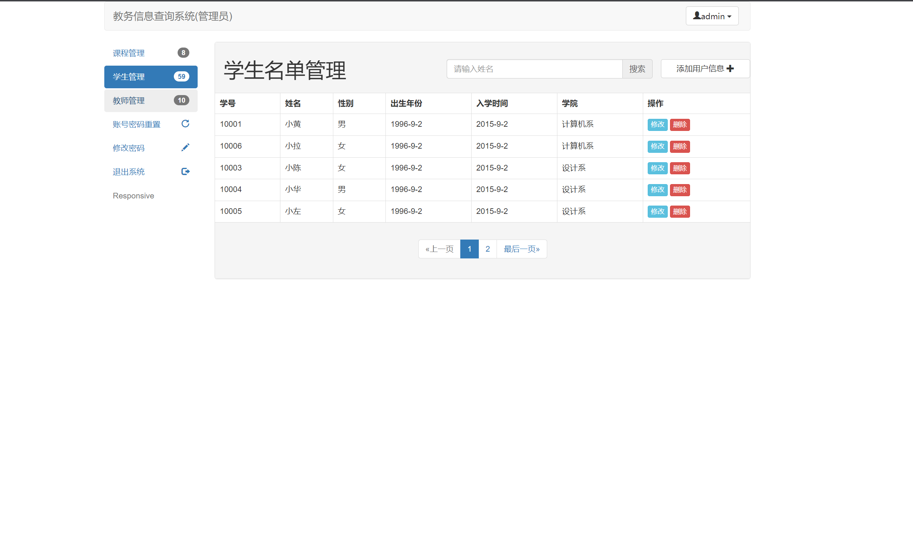
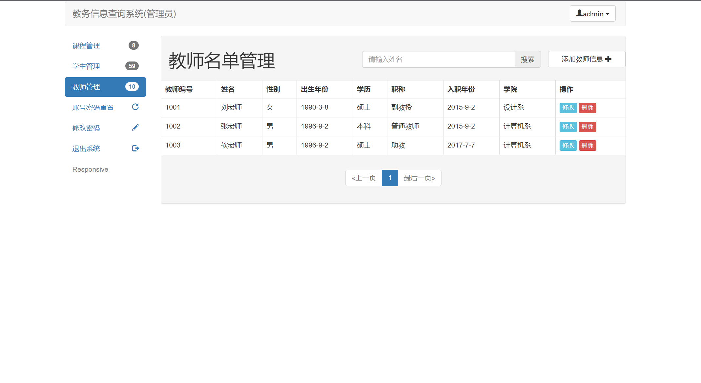
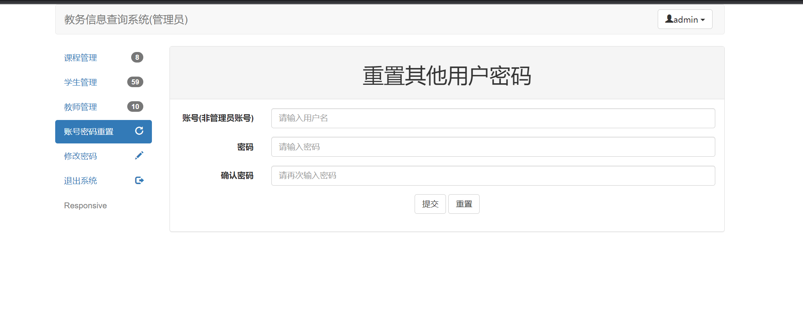
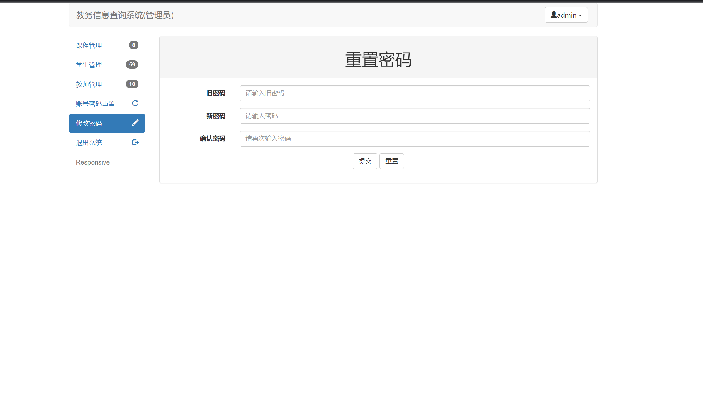

# 项目介绍
1. 简易的教务管理系统
2. 基于 SpringMVC 进行的开发

## 项目结构
```Spring + SpringMVC + MyBatis + MySQL8 + Maven + Tomcat9```

## 项目功能
1. 登录
2. 退出
3. 课程管理
4. 学生管理
5. 教师管理
6. 选课管理
7. 成绩管理
8. 个人信息管理
9. 密码修改

## 项目截图
![登录]

![课程管理]

![学生管理]!

![教师管理]!

![账号密码重置]!

![修改密码]!!
